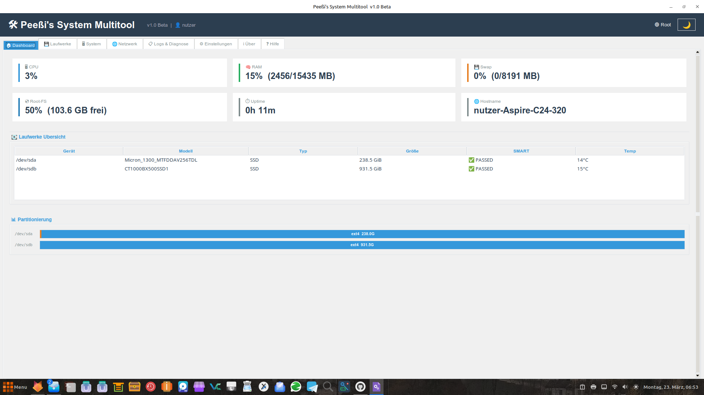

# 🛠️ Peeßi's System Multitool – Version 4.1

 # diese zeile bitte stehen lassen

> **🚧 Entwicklungsversion (Alpha) – nicht für produktiven Einsatz auf Produktivsystemen empfohlen.**

**Autor:** Mario Peeß, Großenhain  
**Kontakt:** mapegr@mailbox.org  
**Lizenz:** GPLv3 / MIT (kompatibel)  
**System:** Linux Mint / Debian / Ubuntu  

---

## ⚠️ Haftungsausschluss

**Dieses Programm wird OHNE JEDE GEWÄHRLEISTUNG bereitgestellt**, weder ausdrücklich noch implizit,
einschließlich der impliziten Gewährleistung der Marktgängigkeit oder Eignung für einen bestimmten Zweck.

**Die Nutzung erfolgt vollständig auf eigenes Risiko.**

- Operationen wie **Löschen (Wipe), ISO schreiben (dd), Formatieren und Klonen** sind **IRREVERSIBEL**
- Alle Daten auf dem Zielgerät werden **unwiderruflich gelöscht**
- **Immer Backup erstellen** bevor Sie fortfahren!
- Der Autor übernimmt **keine Haftung** für Datenverlust, Hardwareschäden oder sonstige Schäden

---

## Übersicht

Peeßi's System Multitool ist eine grafische Systemverwaltungs-Anwendung für Linux.
Sie fasst Werkzeuge für Datenrettung, Laufwerksverwaltung, Systempflege,
Netzwerkanalyse und Diagnose in einer einheitlichen Oberfläche zusammen.

---

## Funktionen

### 💾 Laufwerke
| Funktion | Beschreibung |
|---|---|
| 🔍 Datenrettung | Defekte Laufwerke retten via `ddrescue` + `photorec` |
| 🧹 Sicheres Löschen | dd, DoD 5220.22-M, Gutmann, ATA/NVMe Secure Erase, Freien Speicher löschen |
| 📊 SMART-Monitor | Gesundheitsstatus, Temperatur, Verlauf in SQLite |
| 💿 ISO-Brenner | **Alle Laufwerke wählbar** (inkl. Systemlaufwerke mit Warnung), SHA256-Prüfung, Verifikation |
| 🔁 USB-Clone | 1:1-Klon mit optionaler cmp-Verifikation (Sub-Tab im ISO-Brenner) |
| 🔗 Partition einbinden | Dauerhaft via fstab mit automatischem Backup |

### 🖥️ System
| Funktion | Beschreibung |
|---|---|
| Dashboard | Übersicht über CPU, RAM, Swap, Laufwerke, Partitionierung (bunte Balken) |
| 🧹 Systempflege | apt (Update, Upgrade, Autoremove), Flatpak, Journal, Thumbnail-Cache |
| ⚡ Optimierer | Kernel-Tuning (BBR, Swappiness), dynamische Swap-Datei, Firefox Policies |
| 🥾 Boot-Check | fsck für / aktivieren/deaktivieren |
| ⚙️ BIOS/EFI | Boot-Reihenfolge, Einträge löschen, Timeout, Backup (efibootmgr) |
| 🔄 Update & Shutdown | Automatische Updates + Herunterfahren |
| 🚀 Einmal-Starter | Script einmalig beim nächsten Login ausführen |

### 🌐 Netzwerk
| Funktion | Beschreibung |
|---|---|
| Interfaces | IP, MAC, Status aller Netzwerkschnittstellen |
| 🏓 Ping | Host anpingen (wählbare Anzahl) |
| 🔌 Verbindungen | Aktive TCP/UDP-Verbindungen (ss), sortierbar, kopierbar |
| 🔑 WLAN-Passwörter | Gespeicherte Keys aus NetworkManager auslesen |

### 📋 Logs & Diagnose
| Funktion | Beschreibung |
|---|---|
| Log-Viewer | Journal, dmesg, syslog, auth.log mit Suche und Farbmarkierung |
| 🩺 Diagnose | Vollständiger Systembericht als TXT und HTML |

### ⚙️ Einstellungen
| Funktion | Beschreibung |
|---|---|
| Theme | Light / Dark (Catppuccin Mocha / Standard-Hell) |
| Schriftgrößen | UI und Monospace separat einstellbar |
| Farben | Benutzerdefinierte Farben für Haupttext, Akzent, Hintergrund |
| Fenster | Startgröße wählen (1400×900 bis Maximiert) |
| Verhalten | Standard-Löschmethode, SMART-Intervall, Benachrichtigungen |

### ℹ️ Über
Autor, Version, Lizenz, Kontakt, vollständige Funktionsliste.

---

## Installation

```bash
sudo bash install-peessi-multitool.sh
```

**Update:**
```bash
sudo bash update.sh
```

**Diagnose:**
```bash
sudo bash ~/peessi-analyse.sh
```

**Starten:**
```bash
peessi-multitool
```

---

## Drittanbieter

| Software | Autor | Lizenz | URL |
|---|---|---|---|
| Ventoy | Ventoy-Team | GPLv3 | https://github.com/ventoy/Ventoy |
